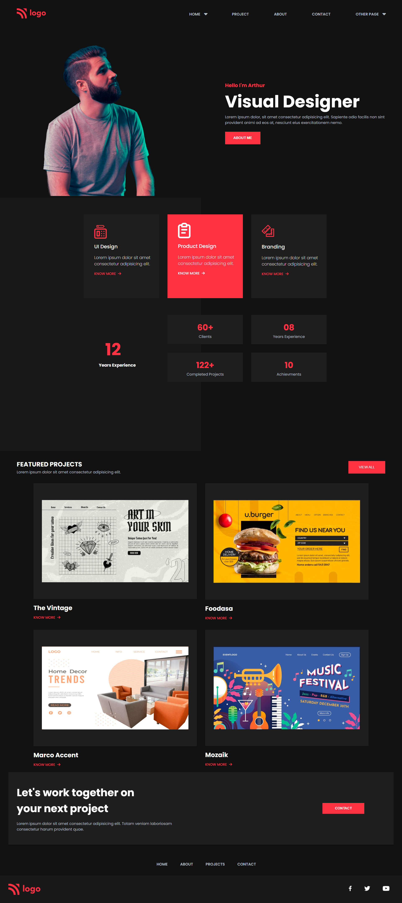

# Project 15: Product Design Landing Page

   

### Name:

> `Anshul Ghogre`

## Key Learnings from the project

- _Right placements of blocks with consistency,helps your project to look aesthetic._

---

### Screenshots:-

---

> Time taken to complete this project: 7hrs

---

## [Live-Link](https://project-15-product-design-landing-pag.netlify.app/)

---
